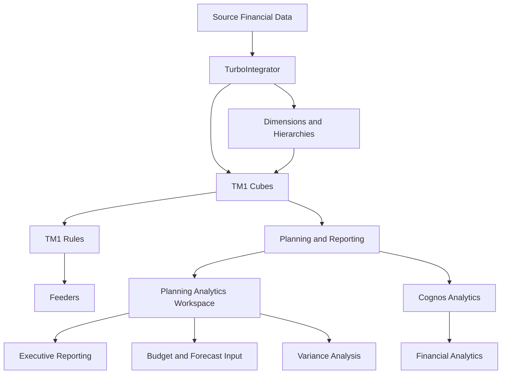

# TM1 Model Architecture

## Overview

This document describes the architecture of the financial planning, budgeting, and forecasting solution developed using IBM Planning Analytics (TM1).

The solution integrates source financial data, TurboIntegrator automation, multidimensional structures, business calculations, validation procedures, and analytical reporting.

## Architecture Diagram



## Data Flow

The overall data flow follows this process:

```text
Source Financial Data
        │
        ▼
TurboIntegrator
        │
        ├── Data Cleansing
        ├── Data Validation
        ├── Dimension Updates
        └── Financial Data Loading
        │
        ▼
Dimensions and Hierarchies
        │
        ▼
TM1 Cubes
        │
        ▼
Rules and Feeders
        │
        ▼
Planning and Reporting
        │
        ├── Planning Analytics Workspace
        └── Cognos Analytics
```

## Core Components

The financial planning solution includes the following major components:

| Component | Description |
|-----------|-------------|
| Source Data | Financial and operational data used as input for planning and reporting |
| TurboIntegrator | Data integration and automation layer |
| Dimensions and Hierarchies | Structures used to organize multidimensional data |
| TM1 Cubes | Multidimensional cubes supporting financial planning and analysis |
| TM1 Rules | Business calculation layer |
| Feeders | Performance support for sparse rule-based calculations |
| Planning Analytics Workspace | Interactive planning and reporting interface |
| Cognos Analytics | Additional reporting and visualization layer |

## Core Cubes

The solution includes multiple cubes designed for different financial planning activities.

| Cube | Purpose |
|------|---------|
| OPEX | Operating expense planning and analysis |
| Budget | Annual financial planning |
| Forecast | Monthly financial projections |
| Workforce | Salary, benefits, and headcount planning |
| General Ledger | Validated financial data and reconciliation |

## Dimensions

The multidimensional model includes the following core dimensions:

| Dimension | Purpose |
|-----------|---------|
| Account | Financial accounts and reporting structures |
| Cost Center | Business units and departments |
| Product | Product categories and subcategories |
| Time | Year, Quarter, Month, and Day |
| Version | Actual, Budget, and Forecast |
| Measures | Financial measures and KPIs |
| Currency | Currency reporting and conversion |

## Dimension Structures

### Time Hierarchy

```text
Year
└── Quarter
    └── Month
        └── Day
```

### Version Structure

```text
Version
├── Actual
├── Budget
└── Forecast
```

Alternate hierarchies can also be used to provide additional reporting flexibility.

## TurboIntegrator Layer

TurboIntegrator processes automate the movement and preparation of data within the TM1 environment.

Processes include:

- General Ledger data loading
- Actual data loading
- Budget data loading
- Forecast data loading
- Dimension maintenance
- Data cleansing
- Data validation
- Cube exports
- Scheduled processing through chores

The automation layer also incorporates:

- Error handling
- Logging
- Checkpoints
- Audit trails

## Business Logic

TM1 Rules provide the core calculation layer of the model.

Business logic includes:

- Allocation calculations
- Salary calculations
- OPEX spreading
- Currency conversion
- Actual vs Budget variance analysis
- Actual vs Forecast variance analysis
- Budget vs Forecast analysis

## Feeders

Feeders support rule-based calculations in sparse cubes and help improve calculation performance.

Their purpose within the architecture is to ensure that calculated cells are correctly identified while reducing unnecessary overfeeding.

## Reporting Layer

### Planning Analytics Workspace

Planning Analytics Workspace supports interactive planning and analytical experiences such as:

- Executive summary reporting
- Trend analysis
- Variance analysis
- Budget input forms
- Forecast input forms
- KPI visualization
- Conditional formatting

### Cognos Analytics

Cognos Analytics provides an additional reporting and visualization layer for financial analysis and business reporting.

## Validation

The model architecture includes validation procedures such as:

- General Ledger reconciliation
- Scenario testing
- Rule accuracy checks
- Stakeholder validation
- Performance testing

## Architecture Objective

The architecture was designed to create a structured financial planning environment where data can move from source systems through automated TM1 processes into multidimensional models and finally into planning and analytical reporting.

The solution reduced reporting time by approximately **30%** while improving the speed, reliability, and accuracy of the planning process.

## Author

**Mayra Rocio Valencia**  
Planning Analytics (TM1) | Data Analytics | Data Science
