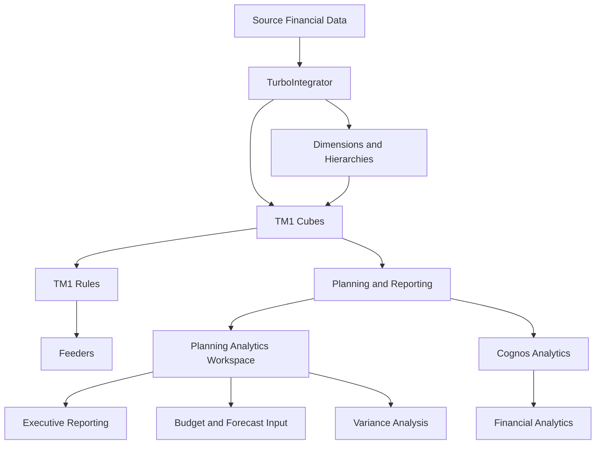
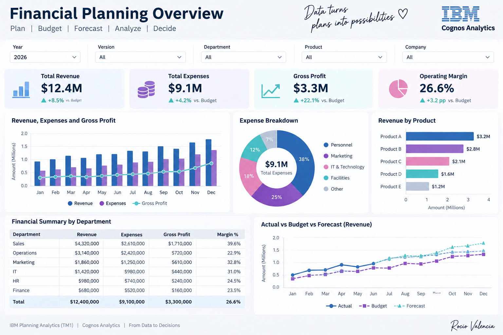

# IBM Planning Analytics (TM1) – Financial Planning Solution

End-to-end financial planning, budgeting, and forecasting solution developed using IBM Planning Analytics (TM1), Planning Analytics Workspace (PAW), Cognos Analytics, and TurboIntegrator.

## Project Overview

The objective of this project was to modernize the financial planning, budgeting, and forecasting process through a structured multidimensional TM1 model.

The solution combines financial modeling, data automation, business logic, validation, and analytical reporting.

My responsibilities included:

- TM1 model design
- Dimension and hierarchy development
- Cube development
- TurboIntegrator automation
- Business Rules and Feeders
- Performance optimization
- Data validation and testing
- Reporting and dashboard development
- Technical documentation
- Stakeholder communication

## Solution Architecture



## Financial Planning Model

The solution includes financial planning and reporting components for:

- OPEX
- Budget
- Forecast
- Workforce Planning
- General Ledger validation

Core dimensions include:

- Account
- Cost Center
- Product
- Time
- Version
- Measures
- Currency

## Rules & Feeders

TM1 Rules were developed to support business calculations including:

- Allocation logic
- Salary calculations
- OPEX spreading
- Currency conversion
- Actual vs Budget variance analysis
- Actual vs Forecast variance analysis
- Budget vs Forecast analysis

Feeders were implemented to support rule-based calculations while improving model performance.

## TurboIntegrator

TurboIntegrator processes were developed to automate:

- General Ledger data loading
- Actual data loading
- Budget data loading
- Forecast data loading
- Dimension updates
- Data cleansing
- Data validation
- Cube exports
- Scheduled processing through chores

The automation layer also includes error handling, logging, checkpoints, and audit trails.

## Planning Analytics Dashboard

The following concept dashboard illustrates the executive analytics experience of the financial planning solution.



> **Portfolio Visualization:** This dashboard was created to visually represent the analytical experience supported by the TM1 financial planning solution.

## Testing & Validation

The model was validated through:

- General Ledger reconciliation
- Scenario testing
- Rule accuracy checks
- Stakeholder validation
- Performance testing

## Project Results

The solution reduced reporting time by approximately **30%**, improved forecasting accuracy, and enabled business users to perform planning activities faster and more reliably.

## Technologies

- IBM Planning Analytics (TM1)
- Planning Analytics Workspace (PAW)
- TurboIntegrator
- TM1 Rules
- Feeders
- MDX
- Cognos Analytics

## Project Documentation

- [Business Case](docs/01-business-case.md)
- [TM1 Model Architecture](docs/02-model-architecture.md)

## Repository Structure

```text
IBM-TM1-Financial-Planning-Solution/
│
├── README.md
├── imageMproject.png
│
└── docs/
    ├── 01-business-case.md
    └── 02-model-architecture.md
```

## Author

**Mayra Rocio Valencia**

Planning Analytics (TM1) | Data Analytics | Data Science
