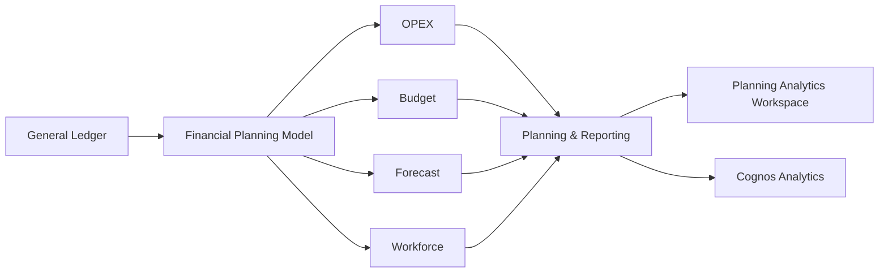

# TM1 Cube Design

## Overview

This section documents the main multidimensional cubes included in the IBM Planning Analytics (TM1) financial planning solution.

The model was designed to support financial planning, budgeting, forecasting, workforce analysis, operating expense management, and General Ledger validation.

The core cubes included in the solution are:

- OPEX
- Budget
- Forecast
- Workforce
- General Ledger

---

## Cube Architecture



---

## OPEX Cube

### Purpose

The OPEX cube supports operating expense planning and analysis.

It is used to organize and analyze operating expenses across the multidimensional planning model.

### Main Business Use

- Operating expense analysis
- Expense planning
- Expense spreading
- Budget comparison
- Forecast comparison
- Variance analysis

### Related Business Logic

The financial planning solution includes OPEX spreading logic implemented through TM1 Rules.

---

## Budget Cube

### Purpose

The Budget cube supports annual financial planning.

It provides a multidimensional environment where budget information can be organized and analyzed across financial and organizational structures.

### Main Business Use

- Annual financial planning
- Budget data loading
- Financial analysis
- Budget comparison
- Variance analysis
- Planning input

### Planning Version

The model supports a Budget version as part of the Version dimension.

```text
Version
├── Actual
├── Budget
└── Forecast
```

---

## Forecast Cube

### Purpose

The Forecast cube supports monthly financial projections.

It allows financial information to be analyzed using projected values and compared with Actual and Budget information.

### Main Business Use

- Monthly financial projections
- Forecast data loading
- Actual vs Forecast analysis
- Budget vs Forecast analysis
- Variance analysis
- Financial planning

---

## Workforce Cube

### Purpose

The Workforce cube supports workforce-related financial planning.

It includes planning information related to:

- Salaries
- Benefits
- Headcount

### Main Business Use

- Workforce planning
- Salary calculations
- Benefits analysis
- Headcount planning
- Financial impact analysis

### Related Business Logic

Salary calculation Rules are part of the TM1 business logic layer.

---

## General Ledger Cube

### Purpose

The General Ledger cube contains validated financial data used as part of the financial planning and reporting process.

It provides a financial reference point for model validation and reconciliation.

### Main Business Use

- Financial data validation
- General Ledger reconciliation
- Actual financial analysis
- Source data verification
- Reporting support

### Data Integration

General Ledger data is loaded through automated TurboIntegrator processes.

The integration layer includes:

- Data loading
- Data cleansing
- Data validation
- Error handling
- Logging
- Audit controls

---

## Core Dimensions

The financial planning model uses dimensions such as:

| Dimension | Purpose |
|-----------|---------|
| Account | Financial accounts and reporting structures |
| Cost Center | Business units and departments |
| Product | Product categories and subcategories |
| Time | Financial reporting periods |
| Version | Actual, Budget, and Forecast scenarios |
| Measures | Financial measures and KPIs |
| Currency | Currency reporting and conversion |

> The exact dimensional structure may vary depending on the purpose of each cube.

---

## Time Structure

The Time dimension supports a hierarchical structure such as:

```text
Year
└── Quarter
    └── Month
        └── Day
```

---

## Version Structure

The Version dimension supports financial planning scenarios:

```text
Version
├── Actual
├── Budget
└── Forecast
```

This structure allows the model to support comparisons such as:

- Actual vs Budget
- Actual vs Forecast
- Budget vs Forecast

---

## Business Logic Across Cubes

TM1 Rules support financial calculations across the model, including:

- Allocation logic
- Salary calculations
- OPEX spreading
- Currency conversion
- Variance calculations

Feeders are used to support rule-based calculations and improve performance in sparse cubes.

---

## Data Integration

TurboIntegrator processes support cube data management activities such as:

- General Ledger loading
- Actual data loading
- Budget loading
- Forecast loading
- Dimension maintenance
- Data cleansing
- Data validation
- Cube exports

Scheduled chores are used to automate recurring processing activities.

---

## Reporting

The cube layer feeds financial planning and analytical reporting through:

- IBM Planning Analytics Workspace
- Cognos Analytics

The reporting environment supports:

- Executive reporting
- Trend analysis
- Variance analysis
- Budget input
- Forecast input
- KPI visualization

---

## Cube Design Objective

The cube architecture was designed to separate major financial planning activities while maintaining a consistent multidimensional structure across the solution.

This enables financial information to move from validated source data into planning, calculation, analysis, and reporting processes within IBM Planning Analytics.

---

## Author

**Mayra Rocio Valencia**

Planning Analytics (TM1) | Data Analytics | Data Science
